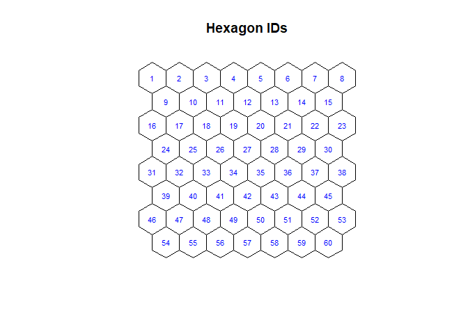
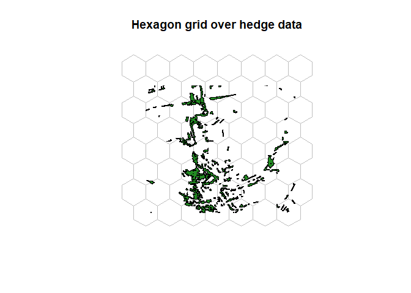
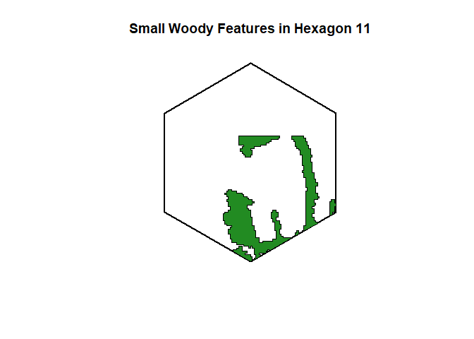
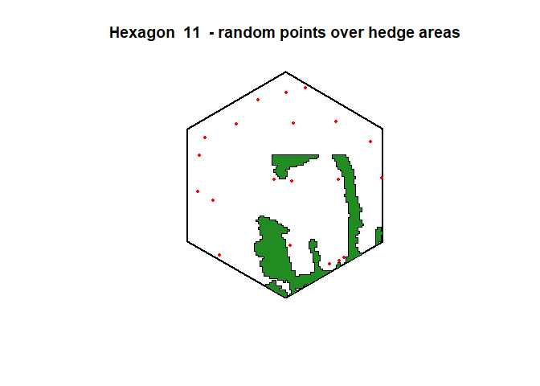

<!-- README.md is generated from README.Rmd. Please edit that file -->

# HedgeConnectivityPackage

<!-- badges: start -->
<!-- badges: end -->

The goal of HedgeConnectivityPackage is to provide simple and useful
functions to calculate connectivity metrics for hedges / Small Woody
Features (SWF), and to generate clear visualizations. This package is
intended to support ecological landscape analysis, habitat connectivity
studies, and conservation planning. The terms “hedge” and “Small Woody
Features” (SWF) are used synonymously throughout the package.

## Features

- **Load and process SWF data**
- **Create and analyze hexagonal grids**
- **Clip and visualize spatial data**
- **Generate and analyze random points**
- **Calculate key connectivity and area metrics**

## Installation

You can install the development version of the HedgeConnectivityPackage
from GitHub using:

``` r
# Install devtools if you haven't yet
install.packages("devtools")

# Then install the package
devtools::install_github("lukas-f00/HedgeConnectivityPackage")
```

## Package Functions

| **Function Number** | **Function Name** | **Description** |
|----|----|----|
| 1 | load_swf_data | Load the SWF raster data and convert it to polygons (sf object) |
| 2 | create_hex_grid | Create a hexagon grid over the SWF data |
| 3 | plot_hex_ids | Plot the hexagon grid with hexagon IDs |
| 4 | swf_grid | Clip the full SWF data to the hexagon grid |
| 5 | plot_swf_grid | Plot the clipped SWF data with the hexagon grid |
| 6 | clip_swf_to_hex | Clip SWF data to one selected hexagon |
| 7 | plot_swf_hex | Plot clipped SWF data with the corresponding hexagon |
| 8 | random_points | Generate random points within a selected hexagon |
| 9 | plot_random_points | Plot random points over the clipped SWF data |
| 10 | hedge_area | Calculate the hedge area percentage within one hexagon |
| 11 | count_hedge_obj | Count the number of hedge/SWF objects in a hexagon |
| 12 | hedge_points_percentage | Calculate the percentage of random points inside hedge/SWF objects |
| 13 | distance_to_nearest_hedge | Calculate mean, min, max distance from points outside hedges to nearest hedge |
| 14 | hedges_nn | Calculate mean, min, max distance between hedge/SWF objects to their x nearest neighbors |

## Example data

The included example data is from the High Resolution Layer Small Woody
Features from the Copernicus Land Monitoring Service.

bibentry( bibtype = “Misc”, title = “High Resolution Layer Small Woody
Features”, author = “COPERNICUS LAND MONITORING SERVICE”, year = “2018”,
datatype = “.tif”, access date = “07.04.2025”, note = “Data included in
the HedgeConnectivityPackage R package
(inst/extdata/HRL_Small_Woody_Features_2018_005m.tif)”, url =
“<https://land.copernicus.eu/en/products/high-resolution-layer-small-woody-features>”,
data policy = “<https://land.copernicus.eu/en/data-policy>” )

## Example

The first step is to load in your function and data and convert the data
to an sf-polygon object.

``` r

library(HedgeConnectivityPackage)

swf <- load_swf_data("inst/extdata/HRL_Small_Woody_Features_2018_005m.tif", 3035)
```

Now you can create a hexagon grid with a selectable diameter,
consecutive IDs and the extent of your data.

``` r

hex_grid <- create_hex_grid(swf, diameter = 500)
```

If you want to inspect your grid and check for the IDs, you can plot the
grid with the according IDs.

``` r

plot_hex_ids(hex_grid)
#> Warning: st_centroid assumes attributes are constant over geometries
```



If you’re happy with the grid, you can then clip your data with it.

``` r

swf_clipped <- swf_grid(swf, hex_grid)
```

To see the outcome of your clip, you can plot your clipped data together
with the grid.

``` r

plot_swf_grid(hex_grid, swf_clipped)
```



Now you can select a individual hexagon to analyze and work with.

``` r

swf_hex <- clip_swf_to_hex(swf, hex_grid, hex_id = 11)
#> Warning: attribute variables are assumed to be spatially constant throughout
#> all geometries
```

To check and investigate your chosen hexagon and the clipped data in it,
you can plot it now.

``` r

plot_swf_hex(hex_grid, swf_hex, hex_id = 11)
```



For more statistical analysis, you can create random points over one
selected hexagon.

``` r

random_pts <- random_points(hex_grid, hex_id = 11, n_points = 20)
```

You can also visualize your created random points together with your
hexagon and data.

``` r

plot_random_points(hex_grid, swf_hex, hex_id = 11, random_pts)
```



For the statistical side of things, you can start by calculating the
hedge area in total area and as percantage towards the hexagon area.

``` r

hedge_area(swf_hex, hex_grid, hex_id = 11)
#> [1] "Hexagon 11 hedge area: 28284.25 m2"
#> [1] "Hexagon 11 hedge area percentage: 13.06%"
#> $hedge_area
#> 28284.25 [m^2]
#> 
#> $ratio
#> [1] 0.1306394
```

After this you can calculate the number of hedge/SWF objects in your
polygon.

``` r

count_hedge_obj(swf_hex, hex_grid, hex_id = 11)
#> Warning: attribute variables are assumed to be spatially constant throughout
#> all geometries
#> [1] "Hexagon 11 contains 6 distinct hedge objects"
#> [1] 6
```

You can now use the crated random points for some analysis. With the
following function you can calculate the percentage of random points
that fall within hedge objects.

``` r

hedge_points_percentage(swf_hex, random_pts, hex_grid, hex_id = 11)
#> [1] "Hexagon 11 percentage of points within hedge objects: 0 %"
#> [1] 0
```

You now know how many points lay outside of the hedges. Following this,
you can calculate the mean, min and max distance for all outside-laying
points to the nearest hedge.

``` r

distance_to_nearest_hedge(swf_hex, random_pts, hex_grid, hex_id = 11)
#> Hexagon 11:
#> Points outside of hedge objects:
#>   Avg. distance to closest hedge: 85.32 m
#>   Min. distance to closest hedge: 4.29 m
#>   Max. distance to closest hedge: 183.62 m
#> $outside_points
#> $outside_points$mean
#> [1] 85.32434
#> 
#> $outside_points$min
#> [1] 4.291185
#> 
#> $outside_points$max
#> [1] 183.6171
#> 
#> 
#> $units
#> $numerator
#> [1] "m"
#> 
#> $denominator
#> character(0)
#> 
#> attr(,"class")
#> [1] "symbolic_units"
```

And, focusing back on the hedges, you can calculate the mean, min, max
distance between hedge patches to their x nearest neighbors.

``` r

hedges_nn(swf_hex, hex_grid, hex_id = 11, nn = 3)
#> Warning: attribute variables are assumed to be spatially constant throughout
#> all geometries
#> Hexagon 11 (3. NN):
#> Mean distance: 63.52 m
#> Min. distance: 0.35 m
#> Max. distance: 233.77 m
#> $mean
#> [1] 63.52149
#> 
#> $min
#> [1] 0.3491763
#> 
#> $max
#> [1] 233.7734
#> 
#> $units
#> $numerator
#> [1] "m"
#> 
#> $denominator
#> character(0)
#> 
#> attr(,"class")
#> [1] "symbolic_units"
```

## Planned Revisions and Extensions

## Revisions

| **Idea** | **Example** |
|----|----|
| Tidying up the functions overall | i.e. shortening function names or making the code cleaner |
| Updating the plots with ggplot2 and more options to customize | i.e. change color or font size |
| Making the plots more barrier-free for people with color blindness or similar restrictions | i.e. with help of the colorblindr package |
| Function 1: load_swf_data() | Add option for vector data |
| Function 13: distance_to_nearest_hedge() | Include points within hedges |
| Function 13: distance_to_nearest_hedge() | Split their distances further into “total distance” and “distance outside of hedges” |

## Extensions

|  | **Explanation** |
|----|----|
| Function: hedge_chain() | Adds up the distances from one hedge to the nearest neighbour. Then from this hedge to the next nearest hedge-object, that is not yet connected. So basically the shortest distance to connect all hedges. |
| Function: isolated_hedges() | Gives out a table, where the hedge objects are ranked by the number for how many other hedge objects they are the nearest neighbour. |
| Function: nearest_hedge_ranking() | Gives out a table, where the hedge objects are ranked by the number for how many random points they are the nearest hedge. |
| Function: points_nn() | Computes the distances (mean, min, max)(total and outside of hedges) for the random points to get to the x nearest neighbour. |
| Overall functions | Creating functions for hedges that are spread over multiple hexagons |
| Overall functions | Creating functions for the whole dataset and not only for the polygons |
| Overall connectivity index for hedges | But only if feasible and sensible |
| Conclusive Index | Creating a overall connectivity index for hedges (but only if feasible and sensible) |
| Other packages | Integrating other packages (i.e. landscapemetrcis) |
| Tests | Integrating tests (i.e. with testthis()) |

## Current Bugs and Problem

At the moment, the examples within the roxygen skeleton of the R scripts
don’t fully work, as the SWF data is way too big when clipped to one
hexagon. But the examples from this readme file work fine.

## Contribution

Thank you for using the HedgeConnectivityPackage! If you find a bug or
want to suggest an improvement, feel free to open an issue or pull
request on GitHub. Also if you want to contribute towards the package,
feel free to contact me! :)
